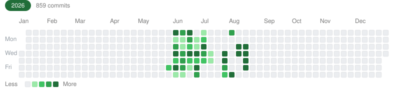

<!-- PINS:START -->

<table>
<tr><td width="330" align="left" valign="top" style="border:1px solid var(--color-border-default); border-radius:6px; padding:10px 14px;"><a href="https://github.com/Gyerchak/Globe-Game"><b>Globe-Game</b></a> Public &nbsp; &#11044; C++ &nbsp; &#11088; 0 &nbsp; &#127860; 0</td><td width="330" align="left" valign="top" style="border:1px solid var(--color-border-default); border-radius:6px; padding:10px 14px;"><a href="https://github.com/Gyerchak/Minkraft"><b>Minkraft</b></a> Public &nbsp; &#11044; C++ &nbsp; &#11088; 0 &nbsp; &#127860; 0</td><td width="330" align="left" valign="top" style="border:1px solid var(--color-border-default); border-radius:6px; padding:10px 14px;"><a href="https://github.com/Gyerchak/Moba"><b>Moba</b></a> Public &nbsp; &#11044; C++ &nbsp; &#11088; 0 &nbsp; &#127860; 0</td></tr>
<tr><td width="330" align="left" valign="top" style="border:1px solid var(--color-border-default); border-radius:6px; padding:10px 14px;"><a href="https://github.com/Gyerchak/HeadControll"><b>HeadControll</b></a> Public &nbsp; &#11044; Shell &nbsp; &#11088; 0 &nbsp; &#127860; 0</td><td width="330" align="left" valign="top" style="border:1px solid var(--color-border-default); border-radius:6px; padding:10px 14px;"><a href="https://github.com/Gyerchak/StockAnalyzer"><b>StockAnalyzer</b></a> Public &nbsp; &#11044; C++ &nbsp; &#11088; 0 &nbsp; &#127860; 0</td><td width="330" align="left" valign="top" style="border:1px solid var(--color-border-default); border-radius:6px; padding:10px 14px;"><a href="https://github.com/Gyerchak/OpenCode-DiscordBot"><b>OpenCode-DiscordBot</b></a> Public &nbsp; &#11044; Shell &nbsp; &#11088; 0 &nbsp; &#127860; 0</td></tr>
</table>

<!-- PINS:END -->

# 👋 Hi, I'm Gyerchak

**Building things, one commit at a time — games, tools and automation.**

<h2 align="center">"aka GitHub Slop"</h2>

| 🚧 Status |
|-----------|
| **All public repositories are currently under development.** A repo shows **✅ Released** once it has a GitHub release — until then it's **🚧 in development**. |

---

## 📊 Metrics

<picture>
  <source media="(prefers-color-scheme: dark)" srcset="./github-metrics-dark.svg#gh-dark-mode-only">
  <source media="(prefers-color-scheme: light)" srcset="./github-metrics-light.svg#gh-light-mode-only">
  
</picture>

---

## 🗓️ Contribution calendars

<picture>
  <source media="(prefers-color-scheme: dark)" srcset="./contributions-dark.svg#gh-dark-mode-only">
  <source media="(prefers-color-scheme: light)" srcset="./contributions.svg#gh-light-mode-only">
  
</picture>

---

## 📦 My public repositories

<!-- STATUS:START -->
**38 public repos** · **0 released** · **38 in development**
<!-- STATUS:END -->

<!-- REPOS:START -->
| Repo | Status | Description | Language | Stars |
|------|--------|-------------|----------|-------|
| [AiBotniak](https://github.com/Gyerchak/AiBotniak) | 🚧 in development |  | Shell | ⭐ 0 |
| [AiGrejhak](https://github.com/Gyerchak/AiGrejhak) | 🚧 in development |  | Shell | ⭐ 0 |
| [autocommit](https://github.com/Gyerchak/autocommit) | 🚧 in development |  | Shell | ⭐ 0 |
| [AzerbajianInteligence](https://github.com/Gyerchak/AzerbajianInteligence) | 🚧 in development |  | Shell | ⭐ 0 |
| [calldeepseek](https://github.com/Gyerchak/calldeepseek) | 🚧 in development |  | Shell | ⭐ 0 |
| [CodePreferences](https://github.com/Gyerchak/CodePreferences) | 🚧 in development |  | Shell | ⭐ 0 |
| [CopyRightsChecker](https://github.com/Gyerchak/CopyRightsChecker) | 🚧 in development |  | Shell | ⭐ 0 |
| [DemandPolandEu](https://github.com/Gyerchak/DemandPolandEu) | 🚧 in development |  | C++ | ⭐ 0 |
| [DenSupply](https://github.com/Gyerchak/DenSupply) | 🚧 in development |  | Shell | ⭐ 0 |
| [EuTransparencyChecker](https://github.com/Gyerchak/EuTransparencyChecker) | 🚧 in development |  | Shell | ⭐ 0 |
| [GameTemplate](https://github.com/Gyerchak/GameTemplate) | 🚧 in development |  | Shell | ⭐ 0 |
| [Globe-Game](https://github.com/Gyerchak/Globe-Game) | 🚧 in development |  | C++ | ⭐ 0 |
| [HeadControll](https://github.com/Gyerchak/HeadControll) | 🚧 in development |  | Shell | ⭐ 0 |
| [HistorAI](https://github.com/Gyerchak/HistorAI) | 🚧 in development |  | Shell | ⭐ 0 |
| [LinuxXiaomiWatchApp](https://github.com/Gyerchak/LinuxXiaomiWatchApp) | 🚧 in development |  | Shell | ⭐ 0 |
| [LocalWaste](https://github.com/Gyerchak/LocalWaste) | 🚧 in development |  | Shell | ⭐ 0 |
| [MAAW-Bot](https://github.com/Gyerchak/MAAW-Bot) | 🚧 in development |  | Shell | ⭐ 0 |
| [MaawSupply](https://github.com/Gyerchak/MaawSupply) | 🚧 in development |  | Shell | ⭐ 0 |
| [Maxim](https://github.com/Gyerchak/Maxim) | 🚧 in development |  | Shell | ⭐ 0 |
| [Minkraft](https://github.com/Gyerchak/Minkraft) | 🚧 in development |  | C++ | ⭐ 0 |
| [Moba](https://github.com/Gyerchak/Moba) | 🚧 in development |  | C++ | ⭐ 0 |
| [NiceEuTransparency](https://github.com/Gyerchak/NiceEuTransparency) | 🚧 in development |  | Shell | ⭐ 0 |
| [nonstop](https://github.com/Gyerchak/nonstop) | 🚧 in development |  | Shell | ⭐ 0 |
| [OpenCode-DiscordBot](https://github.com/Gyerchak/OpenCode-DiscordBot) | 🚧 in development |  | Shell | ⭐ 0 |
| [OpenCodeAndroidChat](https://github.com/Gyerchak/OpenCodeAndroidChat) | 🚧 in development |  | Shell | ⭐ 0 |
| [OpenCodeBox](https://github.com/Gyerchak/OpenCodeBox) | 🚧 in development |  | Shell | ⭐ 0 |
| [OpenCodeLiveTranslator](https://github.com/Gyerchak/OpenCodeLiveTranslator) | 🚧 in development |  | Shell | ⭐ 0 |
| [opensidebar](https://github.com/Gyerchak/opensidebar) | 🚧 in development |  | Python | ⭐ 0 |
| [ProjectTXT](https://github.com/Gyerchak/ProjectTXT) | 🚧 in development |  | C++ | ⭐ 0 |
| [providers](https://github.com/Gyerchak/providers) | 🚧 in development |  | Shell | ⭐ 0 |
| [Remote-OpenCode-DiscordBot](https://github.com/Gyerchak/Remote-OpenCode-DiscordBot) | 🚧 in development |  | Shell | ⭐ 0 |
| [SekretArek](https://github.com/Gyerchak/SekretArek) | 🚧 in development |  | Shell | ⭐ 0 |
| [ShrimpFarmer-Agent](https://github.com/Gyerchak/ShrimpFarmer-Agent) | 🚧 in development |  | Shell | ⭐ 0 |
| [StockAnalyzer](https://github.com/Gyerchak/StockAnalyzer) | 🚧 in development |  | C++ | ⭐ 0 |
| [SystemDefeanMuteSyncDiscordPlugin](https://github.com/Gyerchak/SystemDefeanMuteSyncDiscordPlugin) | 🚧 in development |  | Shell | ⭐ 0 |
| [UserAidjuster](https://github.com/Gyerchak/UserAidjuster) | 🚧 in development |  | Shell | ⭐ 0 |
| [XiaomiWatchApp](https://github.com/Gyerchak/XiaomiWatchApp) | 🚧 in development |  | Shell | ⭐ 0 |
| [XiaomiWatchLinuxConnect](https://github.com/Gyerchak/XiaomiWatchLinuxConnect) | 🚧 in development |  | Shell | ⭐ 0 |
<!-- REPOS:END -->

---

Auto-updated by a scheduled GitHub Action. Pinned cards, contribution calendars and repo status are regenerated automatically; repo status is "released" when the repo has a GitHub release, otherwise "in development".
